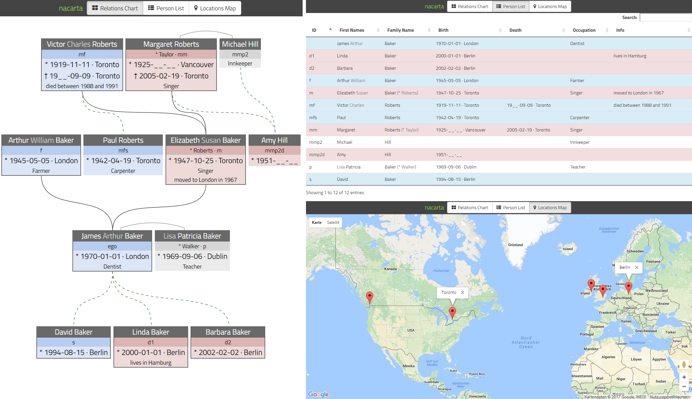

# About
**nacarta** is a set of Web-based genealogy applications for visualizing properties of family members and their relations. The persons in focus comprise a specific `ego` (Latin personal pronoun indicating the subject), its ancestors (parents), their descendants (children) and optionally partners (spouses) of all those persons. Data of each person is specified in one or more JSON database files. nacarta comes with three views:

* **Relations Chart**: In a huge (well, this depends on the size of your database) chart with all family members, each person is represented by a box. The boxes are interconnected to the `ego` reference person. Visual features, such as line styles, color coding of boxes, box border styles, facilitate identifying a variety of facets characterizing individual and aggregated data (sex distribution, linearity, generations count and cardinality).
* **Person List**: The list view provides a table with sortable columns. This is especially helpful for identifying missing data fields. Each line represents a person. They can be filtered by full-text search.
* **Locations Map**: Birth and death locations are visualized in a map with one marker per location. Each marker has a tooltip, which is activated on clicking. Geographical coordinates are determined from location names utilizing the Google Maps Geocoding API. 

# How to Use
**nacarta** comes as a static Web application. Thus, an HTTP server and a Web browser are required. Alternatively, you can also use a built-in Web server of your favorite Web IDE. Point your Web browser to `index.html`. It will provide access to the views with the relations chart loaded per default. A live demonstration with the data of a fictional example family runs at: https://andreasruempel.de/nacarta

Configuration is done within `js/nacarta-config.js`. First of all, you may configure the JSON database `files` containing the data of persons. The value of `basePath` is prepended to each file name. The extension `.json` is appended automatically. To use the map, `mapsKey` for using the geocoding API must be configured. Obtain your own API key at: https://console.developers.google.com/apis/credentials

# System of Person Identifiers
Each person is uniquely identified by an id, which contains information on how the inheritance path is corresponding to the reference person `ego`, having an empty string id. Assuming `ego` being yourself, the database and the diagram expands with your father (having the id `f`) and your mother (having the id `m`). Your father's father (aka. grandfather) is `ff`, one of his other sons would be `ffs` (aka. your uncle). If your father had more the one brother, the further brothers would be `ffs2`, `ffs3` and so on. Mothers (`m`) and daughters (`d`) are treated like fathers and sons respectively.

The family members target group focuses on persons belonging to `ego`'s bloodline (aka. being the n-th generation children of `ego`'s m-th generation ancestors). However, partners (spouses) of each relative may be addressed by adding a `p` (or `p2` or `p3`) to the id. This is especially relevant to distinguish half-siblings, which are the offspring of different partners. Thus, the relation to any of possible relatives may be modeled using combinations of `f`, `m`, `s`, `d`, `p` and numeric indices applicable to `s`, `d` and `p`. Note, that there must not be any gap in the "tree of inheritance". Specifying `mmfs2d` without having `mmf` or `mmfs2` in your database does not work properly.

A more complex example: `mfmp2ssd` is YOUR mother's father's mother's son's son's daughter, while HER father's father's father was the second spouse of YOUR mother's father's mother. More briefly, YOU and HER are "second cousins" of each other, since you have the same great-grandmother (but different great-grandfathers). Thus, it is a combined ascending and descending [genealogical numbering system](https://en.wikipedia.org/wiki/Genealogical_numbering_systems).

The system of identifiers and the corresponding chart rendering imply a few limitations. Each person can be connected to `ego` via one path only, i. e. [pedigree collapse](https://en.wikipedia.org/wiki/Pedigree_collapse) is not supported. Beyond this, each person can only have one father and one mother.

# Shapes, Colors and Names
From the representation of boxes and connection lines within the relations view, essential properties can be derived:

## Boxes
* Grey background: Person not related to `ego`
* Red background: Female relative
* Blue background: Male relative
* Grey frame: Ancestor or descendant of `ego` or `ego` itself (linear kinship)

## Connection Lines
* Light grey (horizontal): Partnership (spouse) relation to non-relative of `ego`
* Solid grey (vertical): Inheritance between linear kinship of `ego`
* Dashed green (vertical): Inheritance to non-linear kinship of `ego`

## Names
* Grey first or middle names: Personal names, which are not used frequently (indicated by square brackets in database)

# Etymology
The name **nacarta** is derived from the latin terms: cog**na**tus (blood relative) + **c**h**arta** (map or paper)
